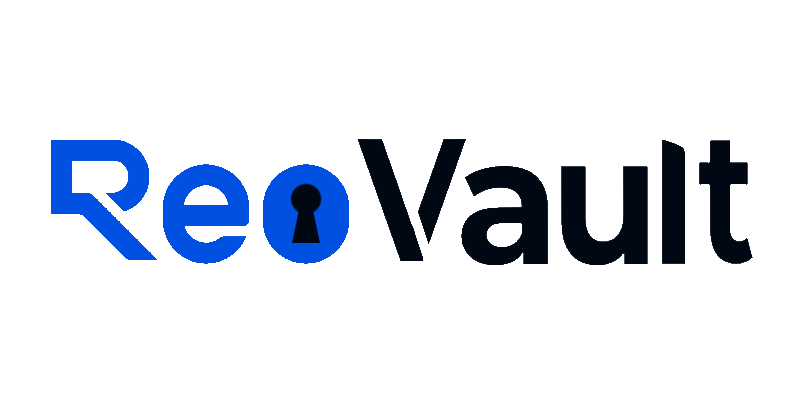

<p align="center">
    
</p>

# ReoVault
Encrypted local backup and archival for Reolink camera recordings.

See [`docs/IMPLEMENTATION_PLAN.md`](docs/IMPLEMENTATION_PLAN.md) for the design and build order.

## Development

```bash
uv sync --dev
cp reovault.example.toml reovault.toml   # edit devices/paths for your setup
uv run reovault doctor                   # offline preflight: config, storage, DB
uv run pytest                            # unit tests (camera-free)
uv run ruff check . && uv run ruff format --check . && uv run mypy reovault
```

Camera-touching work (`reovault probe`, real fixtures, contract tests) needs
`reolink-cli` installed and a doorbell on the LAN. See the plan's
Verification section.
