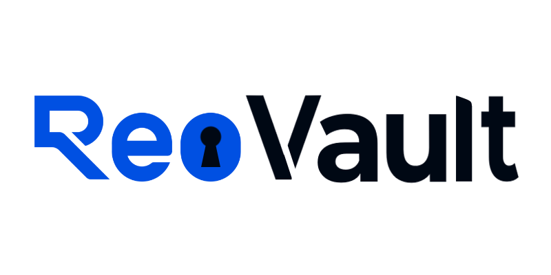
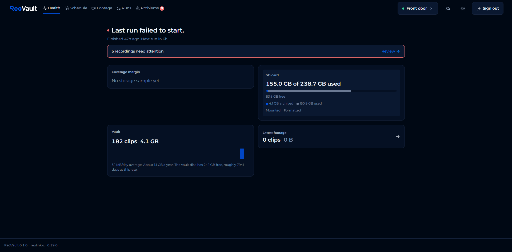

<p align="center">
    
</p>

# ReoVault

[](https://github.com/wiebe-vandendriessche/reovault/actions/workflows/ci.yml)
[](https://github.com/wiebe-vandendriessche/reovault/releases)
[](LICENSE)
[](https://wiebe-vandendriessche.github.io/reovault/)

> **Unofficial, independent project.** ReoVault itself is not affiliated with, endorsed by, or sponsored by Reolink. "Reolink" and any related names, logos, or trademarks belong to their respective owners and are used here only to describe device compatibility. ReoVault talks to cameras through Reolink's own official [`reolink-cli`](https://github.com/reolink/reolink-cli) tool (published under the `reolink` GitHub organization), never a reimplementation of Reolink's protocol.

Local-first, self-hosted archiving of Reolink camera recordings: pulls recordings off the camera's SD card before the loop-overwrite eats them, verifies them, encrypts them at rest, and stores them durably.

Full docs (installation, configuration reference, CLI reference, architecture): **https://wiebe-vandendriessche.github.io/reovault/**

## Screenshots

<table>
<tr>
<td width="50%"></td>
<td width="50%"></td>
</tr>
<tr>
<td width="50%"></td>
<td width="50%"></td>
</tr>
</table>

## Status

Implemented and tested end to end (provider layer, database, crypto/vault, archiver, scheduler/health, the web dashboard as an installable PWA, and Docker packaging). Verified against real camera hardware, not just fakes/mocks. See [compatible devices](https://wiebe-vandendriessche.github.io/reovault/compatibility/). Pre-1.0: expect the config schema to still move.

## Docker

```bash
cp reovault.example.toml reovault.toml   # edit [[devices]] etc.
mkdir -p secrets && echo -n "a passphrase, not the camera's" > secrets/reovault_master_passphrase.txt
docker compose run --rm reovault key init
docker compose up -d
docker compose exec reovault reovault web set-password
```

`compose.yaml` supports two deployment modes: behind a reverse proxy (Nginx Proxy Manager, Traefik, ...) with no port published by default, or a direct port publish for LAN/VPN access. See the comments at the top of `compose.yaml` and [Security](https://wiebe-vandendriessche.github.io/reovault/security/#deployment-modes) for what each needs.

`./data/{config,vault,staging}` and `./data/reolink-cli` (reolink-cli's own credential registry, written to when a camera is added from the Devices tab) are bind mounts, gitignored. `./secrets/reovault_master_passphrase.txt` is a Docker secret file, also gitignored; never commit it.

The image bakes in a version-pinned, checksum-verified `reolink-cli` release (`REOLINK_CLI_VERSION` build arg, default `0.19.0`); `reovault doctor` asserts it at startup. `reovault daemon` is the container's entrypoint and supervises the `reolink-gateway` sidecar in-process, so nothing else needs to run alongside it.

## Quick start

Prerequisites: [`reolink-cli`](https://github.com/reolink/reolink-cli) installed and a camera registered under an alias (`reolink-cli device add <alias> --host <ip> --user admin`), and its gateway reachable (`reolink-cli gateway start --addr 127.0.0.1:9000 &`). ReoVault never touches the camera password itself, see [Architecture](https://wiebe-vandendriessche.github.io/reovault/architecture/).

```bash
uv sync --dev
cp reovault.example.toml reovault.toml   # set [[devices]] alias/timezone to match reolink-cli's, and storage paths

export REOVAULT_MASTER_PASSPHRASE="a passphrase, not the camera's"
uv run reovault key init                 # creates data/config/master.key (0600)
uv run reovault doctor                   # preflight: config, storage, DB, key. No camera contact.
uv run reovault probe                    # confirms the camera/gateway are reachable

uv run reovault run --from 2026-04-17T00:00:00 --to 2026-04-17T23:59:59   # one-shot archive run (UTC)
uv run reovault status                   # archived count, bytes, SD card status
uv run reovault verify --all             # re-decrypt + re-hash every archived file
uv run reovault export <id> -o clip.mp4  # decrypt one archived recording back out

uv run reovault web set-password         # sets the dashboard login (data/config/web_password, 0600)
uv run reovault daemon                   # scheduler + dashboard: http://127.0.0.1:8080
```

`reovault --help` and `reovault key --help` list every command.

## Dashboard

`reovault daemon` serves a server-rendered dashboard (FastAPI + Jinja2 + HTMX, no build step, no Node) at the configured `[web]` host/port, installable as a PWA (Add to Home Screen) on a phone. It's password-protected (`reovault web set-password`), date-first for browsing footage (a month calendar drills into a day grouped by hour), and plays clips straight from the encrypted vault over HTTP `Range` requests, never decrypting more than what's being watched or seeked to.

See [Security](https://wiebe-vandendriessche.github.io/reovault/security/#deployment-modes) for the `[web]` settings each deployment mode (reverse proxy vs. direct port) needs, and [Architecture](https://wiebe-vandendriessche.github.io/reovault/architecture/) for the full design.

## Development

See [CONTRIBUTING.md](CONTRIBUTING.md) for the full guide.

```bash
uv sync --dev
uv run pytest                            # unit + integration tests (camera-free, uses a fake provider)
uv run ruff check . && uv run ruff format --check . && uv run mypy reovault
```

Camera-touching work (`reovault probe`/`run` against real hardware, capturing fixtures, contract tests) needs `reolink-cli` installed and a supported camera on the LAN. See [compatible devices](https://wiebe-vandendriessche.github.io/reovault/compatibility/).
