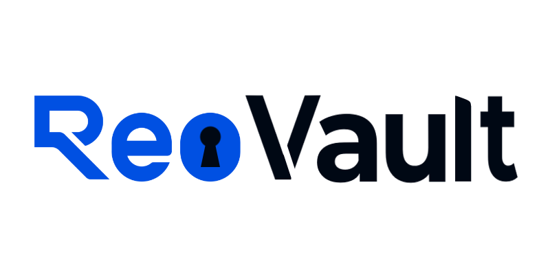
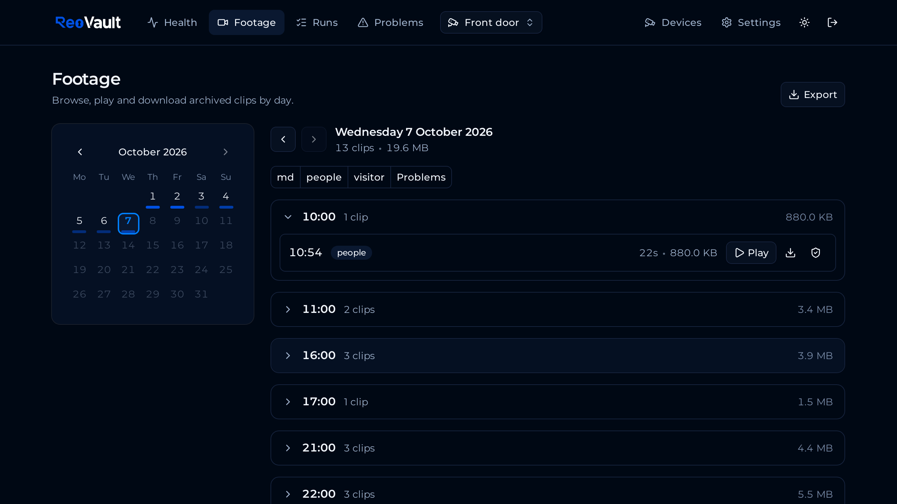
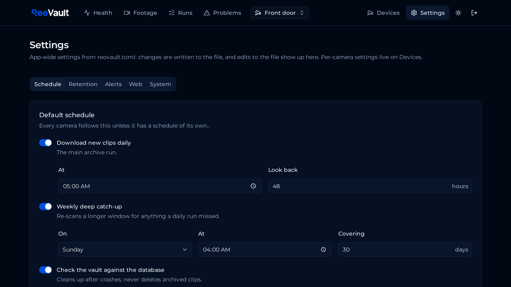
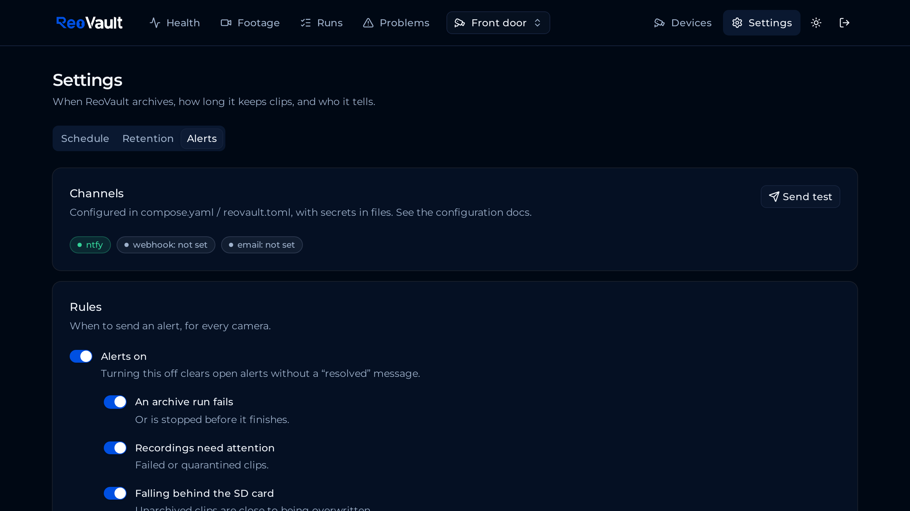
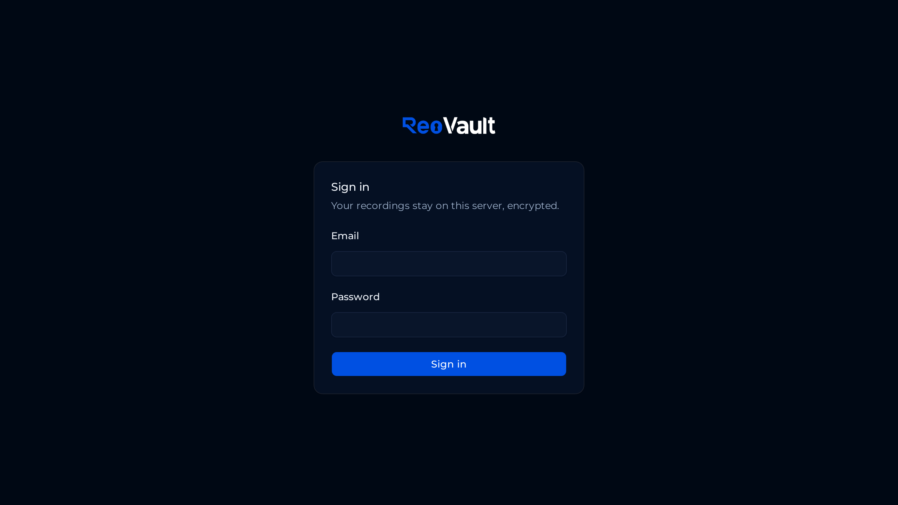

<p align="center">
    
</p>

# ReoVault

[](https://github.com/wiebe-vandendriessche/reovault/actions/workflows/ci.yml)
[](https://github.com/wiebe-vandendriessche/reovault/releases)
[](LICENSE)
[](https://wiebe-vandendriessche.github.io/reovault/)

> **Unofficial, independent project.** ReoVault itself is not affiliated with, endorsed by, or sponsored by Reolink. "Reolink" and any related names, logos, or trademarks belong to their respective owners and are used here only to describe device compatibility. ReoVault talks to cameras through Reolink's own official [`reolink-cli`](https://github.com/reolink/reolink-cli) tool (published under the `reolink` GitHub organization), never a reimplementation of Reolink's protocol.

Local-first, self-hosted archiving of Reolink camera recordings: pulls recordings off the camera's SD card before the loop-overwrite eats them, verifies them, encrypts them at rest, and stores them durably.

Full docs (installation, configuration reference, CLI reference, architecture): **https://wiebe-vandendriessche.github.io/reovault/**

## Screenshots

<table>
<tr>
<td width="50%"></td>
<td width="50%"></td>
</tr>
<tr>
<td width="50%"></td>
<td width="50%"></td>
</tr>
<tr>
<td width="50%"></td>
<td width="50%"></td>
</tr>
</table>

## Status

Implemented and tested end to end (provider layer, database, crypto/vault, archiver, scheduler/health, alerts, the web dashboard as an installable PWA, and Docker packaging). Verified against real camera hardware, not just fakes/mocks. See [compatible devices](https://wiebe-vandendriessche.github.io/reovault/compatibility/). Pre-1.0: expect the config schema to still move.

## Docker

Signed images for `linux/amd64` and `linux/arm64` are published at `ghcr.io/wiebe-vandendriessche/reovault`. No clone needed:

```bash
mkdir reovault && cd reovault
curl -fsSLO https://raw.githubusercontent.com/wiebe-vandendriessche/reovault/main/compose.yaml
mkdir -p config data/config data/vault data/staging data/reolink-cli secrets
curl -fsSL https://raw.githubusercontent.com/wiebe-vandendriessche/reovault/main/reovault.example.toml -o config/reovault.toml
# edit config/reovault.toml: your [[devices]], and set [web] email (set-password needs it)

echo -n "a passphrase, not the camera's" > secrets/reovault_master_passphrase.txt

docker compose run --rm reovault key init
docker compose up -d
docker compose exec reovault reovault web set-password
```

Create `config/reovault.toml` and the `data/` folders before the first `docker compose` command: otherwise Docker creates them as root, and the container (uid 1000) can't write to them. Upgrade with `docker compose pull && docker compose up -d`; coming from 0.3, see [Upgrading](https://wiebe-vandendriessche.github.io/reovault/installation/#upgrading).

Everything in `reovault.toml` is editable on the dashboard's Settings page, which writes your changes back into the file (comments kept), and edits you make to the file show up in the dashboard within seconds.

`compose.yaml` supports two deployment modes: behind a reverse proxy (Nginx Proxy Manager, Traefik, ...) with no port published by default, or a direct port publish for LAN/VPN access. See the comments at the top of `compose.yaml` and [Security](https://wiebe-vandendriessche.github.io/reovault/security/#deployment-modes) for what each needs.

`./data/` holds everything that must survive an upgrade (database, master key, dashboard password, the archive). `./secrets/reovault_master_passphrase.txt` is a Docker secret file; never commit it. The image bakes in a version-pinned, checksum-verified `reolink-cli` release, and `reovault daemon` supervises its `reolink-gateway` sidecar in-process, so nothing else needs to run alongside it.

[Installation](https://wiebe-vandendriessche.github.io/reovault/installation/) covers upgrading, pinning a version, verifying the image signature, and building from source.

## Dashboard

The container serves the dashboard on port 8080: a Svelte single-page app on a typed JSON API, updated live over Server-Sent Events, installable as a PWA (Add to Home Screen) on a phone. It's password-protected (`reovault web set-password`) and covers:

* **Health**: is everything archived, is there room for it, vault growth and detections per type over the last 30 days, and run now, backfill or check the vault on demand, with live progress while a run is going.
* **Footage**: date-first browsing (a month calendar drills into a day grouped by hour), filtered by detection type, with per-day counts on hover. On a phone, clips open in a bottom-sheet player that steps through the hour. Clips play straight from the encrypted vault over HTTP `Range` requests, never decrypting more than what's being watched or seeked to, and a date range downloads as one zip.
* **Runs** and **Problems**: every archive run, and the recordings that failed, with a retry for one or all of them.
* **Devices**: every camera with its status, adding one from LAN discovery, turning archiving on or off, and editing its name, timezone and (optionally) its own schedule.
* **Settings**: the app-wide part of `reovault.toml`: the default schedule, retention, alerts, and the web and system settings.

**Alerts** go out over ntfy, a webhook (Slack and Discord URLs work as-is) or email when a run fails, recordings need attention, a camera falls behind its SD card, or the camera gateway is down. See [Installation](https://wiebe-vandendriessche.github.io/reovault/installation/#alerts).

See [Security](https://wiebe-vandendriessche.github.io/reovault/security/#deployment-modes) for the `[web]` settings each deployment mode (reverse proxy vs. direct port) needs, and [Architecture](https://wiebe-vandendriessche.github.io/reovault/architecture/) for the full design.

## Development

See [CONTRIBUTING.md](CONTRIBUTING.md) for the full guide, including running the daemon from a checkout without Docker and the CLI commands.

```bash
uv sync --dev
uv run pytest                            # unit + integration tests (camera-free, uses a fake provider)
uv run ruff check . && uv run ruff format --check . && uv run mypy reovault

cd dashboard && npm ci --ignore-scripts
npm run dev                              # the dashboard on :5173, proxying /api to a daemon on :8080
npm run check && npm test && npm run build
```

Camera-touching work (`reovault probe`/`run` against real hardware, capturing fixtures, contract tests) needs `reolink-cli` installed and a supported camera on the LAN. See [compatible devices](https://wiebe-vandendriessche.github.io/reovault/compatibility/).
