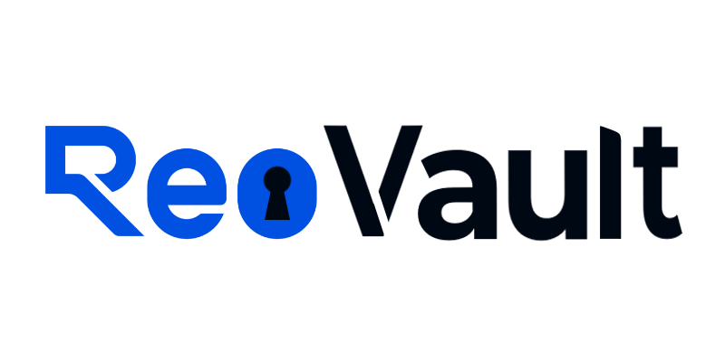

<p align="center">
    
</p>

# ReoVault

[](https://github.com/wiebe-vandendriessche/reovault/actions/workflows/ci.yml)
[](https://github.com/wiebe-vandendriessche/reovault/releases)
[](LICENSE)
[](https://wiebe-vandendriessche.github.io/reovault/)

> **Unofficial, independent project.** ReoVault itself is not affiliated with, endorsed by, or sponsored by Reolink. "Reolink" and any related names, logos, or trademarks belong to their respective owners and are used here only to describe device compatibility. ReoVault talks to cameras through Reolink's own official [`reolink-cli`](https://github.com/reolink/reolink-cli) tool (published under the `reolink` GitHub organization), never a reimplementation of Reolink's protocol.

Self-hosted backups of Reolink SD cards: ReoVault copies every clip off each camera's SD card before the loop recording overwrites it, into an encrypted [restic](https://restic.net/) backup on a local disk, Nextcloud, OneDrive, S3 or anything else [rclone](https://rclone.org/) reaches. Your footage stays restorable with plain restic, with or without ReoVault.

Full docs (installation, dashboard guide, configuration reference, architecture): **https://wiebe-vandendriessche.github.io/reovault/**

## How it works

```
camera SD card --reolink-cli--> one 2 GB batch on local disk --restic--> your destination
```

* Backs up every hour by default: clips recorded since the last run first, then the oldest ones, which the card overwrites next.
* restic does the storing: encryption, deduplication, integrity checks and retention ("keep N days", or forever).
* A clip counts as backed up only after its size matched the card's and restic confirmed a snapshot. When the destination is down, ReoVault stops downloading and the clips wait on the SD card, so local disk never holds more than one batch.
* Alerts over ntfy, a webhook (Slack and Discord URLs work as-is) or email when backups keep failing or clips are about to be overwritten before they're backed up.
* Playback stays in the Reolink app for what's still on the card; ReoVault's dashboard downloads anything that's backed up.

## Docker

Signed images for `linux/amd64` and `linux/arm64` are published at `ghcr.io/wiebe-vandendriessche/reovault`, with pinned, checksum-verified `reolink-cli`, `restic` and `rclone` inside.

```bash
mkdir reovault && cd reovault
curl -fsSLO https://raw.githubusercontent.com/wiebe-vandendriessche/reovault/main/compose.yaml
mkdir -p config/rclone data reolink-cli secrets
curl -fsSL https://raw.githubusercontent.com/wiebe-vandendriessche/reovault/main/reovault.example.toml -o config/reovault.toml
# edit config/reovault.toml: [backup] repository and [web] email
# for a cloud destination: put your rclone.conf in config/rclone/

openssl rand -base64 32 | tr -d '\n' > secrets/restic_password.txt   # keep a copy: it unlocks every backup

docker compose run --rm reovault web set-password
docker compose up -d
docker compose exec reovault reovault doctor
```

Then add cameras on the dashboard (port 8080). Create the folders before the first `docker compose` command: otherwise Docker creates them as root and the container (uid 1000) can't write to them. [Installation](https://wiebe-vandendriessche.github.io/reovault/installation/) covers destinations, the first run on a full card, deployment behind a reverse proxy, and verifying the image signature.

## Dashboard

A Svelte single-page app on a typed JSON API, updated live over Server-Sent Events, installable as a PWA, password-protected:

* **Overview**: is every SD card backed up; per camera what's waiting, how long until it catches up, and the card's fill; the destination and retention.
* **Footage**: a month calendar and the day's clips by hour, filterable by detection type; download a clip or a whole day as a zip, straight out of restic.
* **Activity**: every backup run, clips that keep failing, and clips the card overwrote before they could be backed up.
* **Cameras**: add from LAN discovery (the camera password goes straight into reolink-cli's encrypted registry), turn backups on or off, rename.
* **Settings**: the backup destination (with a test), interval, retention, alerts; written back into `reovault.toml` with your comments kept.

## Development

See [CONTRIBUTING.md](CONTRIBUTING.md), including a demo-camera dev setup that needs no hardware.

```bash
uv sync --dev
PATH=$PWD/.tools:$PATH uv run pytest     # the tests run the real pinned restic and rclone, see CONTRIBUTING.md
uv run ruff check . && uv run ruff format --check . && uv run mypy reovault

cd dashboard && npm ci --ignore-scripts
npm run dev                              # the dashboard on :5173, proxying /api to a daemon on :8080
npm run check && npm test && npm run build
```
