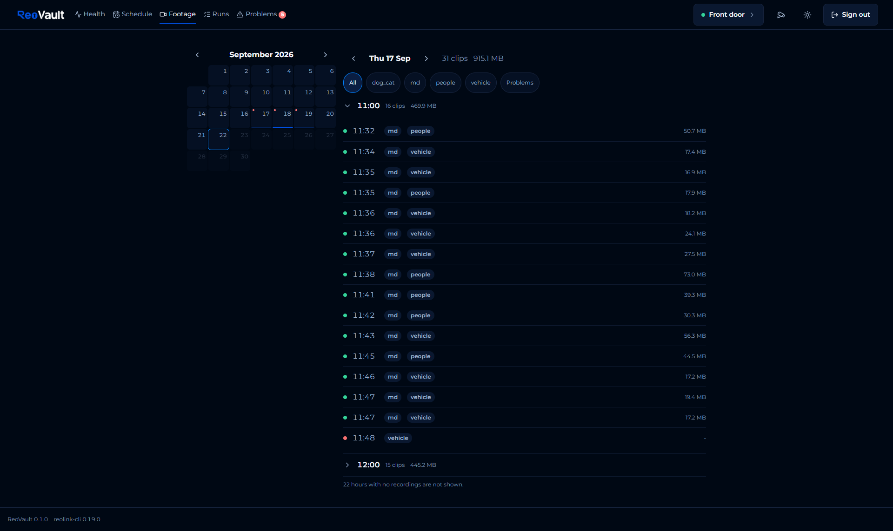
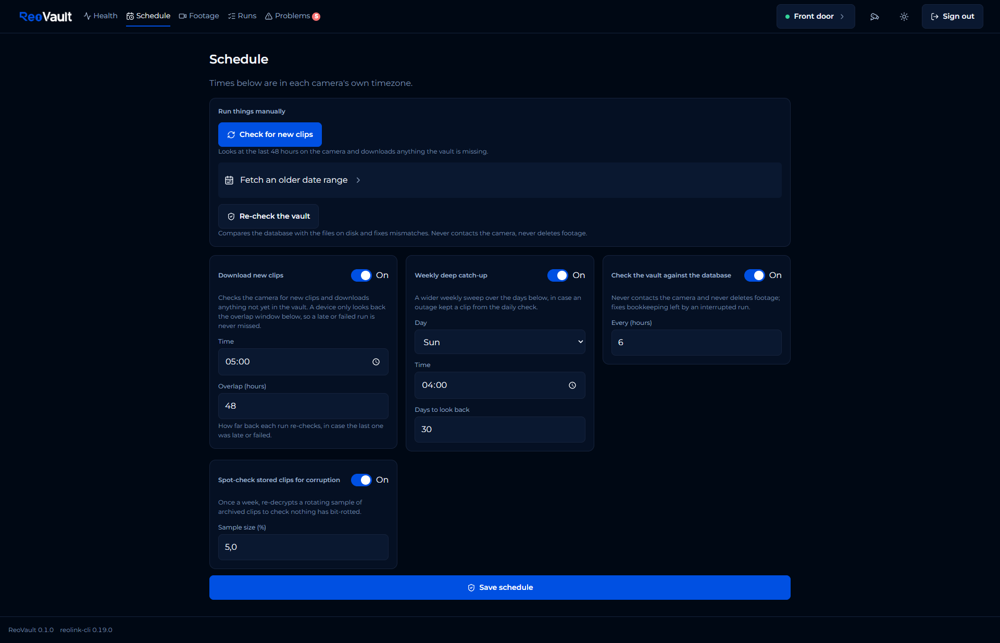
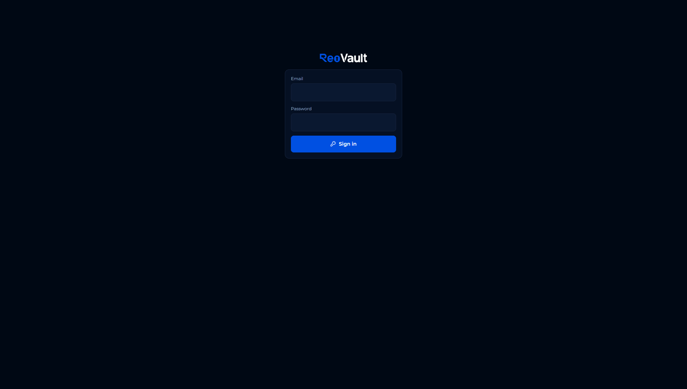

# ReoVault

!!! note "Unofficial, independent project"
    ReoVault itself is not affiliated with, endorsed by, or sponsored by Reolink. "Reolink" and any related names, logos, or trademarks belong to their respective owners and are used here only to describe device compatibility. ReoVault talks to cameras through Reolink's own official [`reolink-cli`](https://github.com/reolink/reolink-cli) tool (published under the `reolink` GitHub organization), never a reimplementation of Reolink's protocol.

Local-first, self-hosted archiving of Reolink camera recordings: pulls
recordings off the camera's SD card before the loop-overwrite eats them,
verifies them, encrypts them at rest, and stores them durably.

Recordings stay on the camera's own storage day to day; ReoVault periodically
pulls them onto your own storage, so you keep a durable, encrypted copy that
doesn't depend on the SD card's limited retention.

## Why

Reolink cameras record to a microSD card that loop-overwrites once it fills
up. Without something pulling recordings off before that happens, older
footage is gone permanently, with no local or durable archive of what the
camera saw.

## Core requirements

* **Reliability**: network failures, interrupted downloads, camera
  restarts, and process restarts are treated as normal conditions, never as
  reasons to lose data already archived.
* **Deduplication**: a recording already archived is never re-downloaded.
* **Integrity verification**: archived files are periodically re-verified
  (checksum + decrypt) so bit rot is caught while a copy still exists
  elsewhere.
* **Encrypted storage**: recordings are encrypted at rest with a
  passphrase-wrapped master key.

## Architecture at a glance

Camera-specific behavior is isolated behind a provider/adapter boundary,
today's implementation talks to cameras through
[`reolink-cli`](https://github.com/reolink/reolink-cli), so adding another
camera integration later doesn't touch the archiver, scheduler, storage, or
dashboard. See [Architecture](architecture.md) for the full picture.

## Screenshots

<table>
<tr>
<td width="50%"></td>
<td width="50%"></td>
</tr>
<tr>
<td width="50%"></td>
<td width="50%"></td>
</tr>
</table>

## Where to go next

* [Installation](installation.md): Docker Compose or bare-metal setup
* [Configuration](configuration.md): every `reovault.toml` / env var option
* [CLI reference](cli-reference.md): every `reovault` subcommand
* [Architecture](architecture.md): how the pieces fit together
* [Security](security.md): the encryption model and how to report a
  vulnerability
